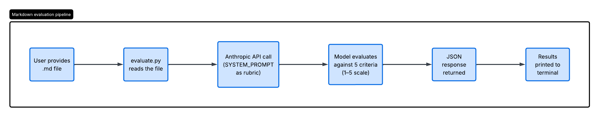
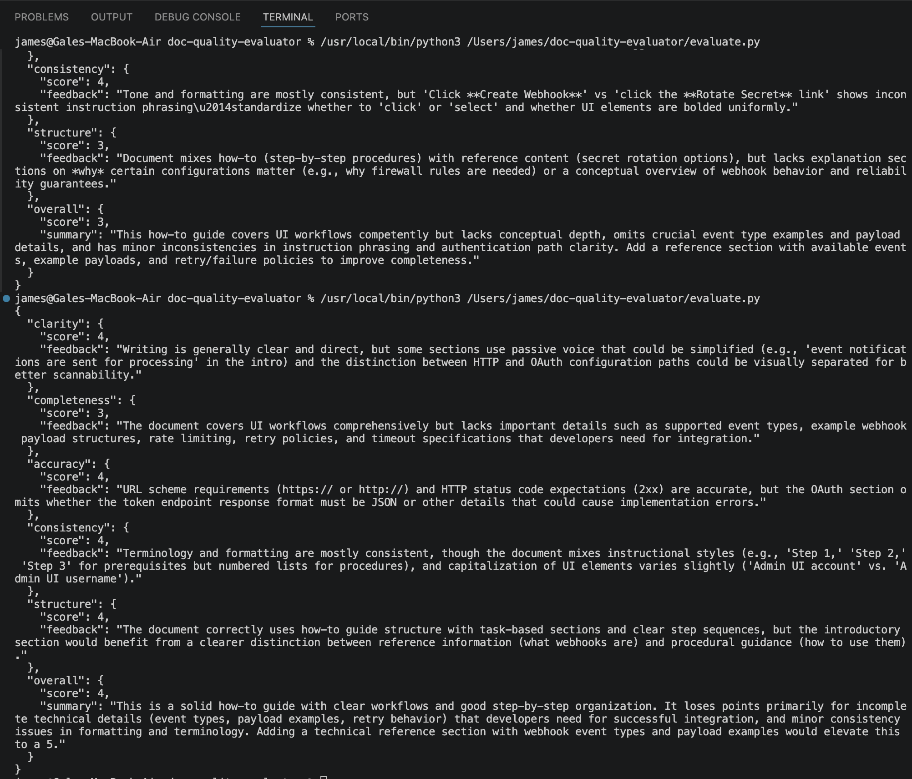

# Doc quality evaluator

The `doc-quality-evaluator` (evaluator) uses Python and the Anthropic API to quickly assess doc quality. It streamlines reviews and leaves final judgment to editors.

All doc samples in the [portfolio](https://github.com/GaleJames-creator/gale-james) were evaluated using this tool before publishing.

## How it works

The `doc-quality-evaluator` automates doc workflows with AI as a force multiplier, letting you keep editorial control. It scores a Markdown doc on five criteria and returns structured JSON feedback.

* **Clarity**: Is the writing clear and free of ambiguity?
* **Completeness**: Are all parameters, responses, and error codes documented?
* **Accuracy**: Are code examples syntactically correct and realistic?
* **Consistency**: Are the terminology, tone, and formatting consistent throughout?
* **Structure**: Does the content follow the appropriate Diátaxis type (tutorial / how-to / reference / explanation)?

Scores range from 1 (lowest) to 5 (highest). The evaluator provides clear feedback to improve your doc. If you see a 0, check your input file.



The evaluator returns your results only as JSON. It does not include any explanations, preambles, or Markdown code fences — only raw JSON. For example, when the evaluator reviewed this README, it provided the following feedback:

```json
All major setup steps and output fields are documented, but the customization section lacks concrete examples of what the modified SYSTEM_PROMPT should look like for the suggested use cases.
```

You can see the response to this feedback in the [Replacing the Diátaxis criterion with a style guide check](#replacing-the-diátaxis-criterion-with-a-style-guide-check) section.

After you update the Markdown doc based on the evaluator's feedback, you'll see the scores and evaluations improve. The following example shows the final result for this README doc.

```json
{
  "clarity": {
    "score": 5,
    "feedback": "Writing is clear, well-organized, and free of ambiguity; technical terms are defined and instructions are easy to follow."
  },
  "completeness": {
    "score": 5,
    "feedback": "All setup steps, prerequisites, JSON output fields, and troubleshooting scenarios are thoroughly documented with examples."
  },
  "accuracy": {
    "score": 5,
    "feedback": "All code examples (Python file paths, bash commands, JSON structures) are syntactically correct and directly executable."
  },
  "consistency": {
    "score": 5,
    "feedback": "Terminology, formatting, code block styling, and tone remain consistent throughout; headings follow a logical hierarchy and lists use parallel structure."
  },
  "structure": {
    "score": 5,
    "feedback": "Documentation effectively blends how-to guidance (Setup, Usage sections) with reference material (JSON output format table, troubleshooting) and explanation (How it works, Assumptions)."
  },
  "overall": {
    "score": 5,
    "summary": "Excellent documentation that successfully balances accessibility for new users with detailed reference information for advanced customization; structure, examples, and completeness are all exemplary."
  }
}
```

## Assumptions

This guide assumes basic familiarity with Git, Python, and the command line.

## Prerequisites

* Python 3.x
* Any code editor, such as VS Code, or write the files in a plain-text editor and run the evaluator from the Terminal.
* Git — need to clone the doc-quality-evaluator repository.
* Anthropic API account and API key. Limit access to your Anthropic key to those who need it. Do not store it in a version control system. When you add it to the `.env` file, it's never pushed to your GitHub repository.

> **API costs**: An Anthropic API key is required. Anthropic accounts receive a small amount of starter credits for API calls. After that, usage is billed per token. The cost to run the evaluator against a typical doc is a fraction of a cent per evaluation. See [Anthropic's pricing page](https://claude.com/pricing) for current rates.

## Supported formats

This section describes supported file formats for reference.

* Markdown (`.md`): fully supported and tested

> **Note**: The evaluator reads plain text files. Other plain text formats, such as `.txt`, may work but have not been tested. Binary formats such as `.docx` are not supported.

## Repository structure

The repository contains the following files.

```markdown
├── evaluate.py              # Main evaluation script
├── requirements.txt         # Python dependencies
├── sample_report.json       # Example JSON output
├── images/
│   └── evaluation-pipeline.png  # Evaluation workflow diagram
└── samples/
    └── webhooks-Admin-UI.md # Sample doc used for testing
```

## Setup

Before running the evaluator, complete the following steps.

1. Clone the `doc-quality-evaluator` repository to your machine.
2. Run the `pip install -r requirements.txt` in your local Python environment to install the evaluator's Python dependencies.
3. Add a `.env` file to the root level of the cloned environment and include your Anthropic key.

    ```bash
    ANTHROPIC_API_KEY=your-actual-key-here
    ```

4. Add your Markdown file to the `samples/` folder.

5. Update the line in `evaluate.py` to match the actual Markdown file name.

    ```python
    with open("samples/webhooks-Admin-UI.md", "r") as f:
    ```

    So if your doc is called `webhooks.md`, change it to:

    ```python
    with open("samples/webhooks.md", "r") as f:
    ```

6. To run the evaluator, enter the following command in a terminal:

    ```bash
    python3 evaluate.py
    ```

7. Verify the raw JSON results appear in the output. It will look like:

    

8. Repeat steps 4-7 for each additional Markdown file.

## Usage

This section describes the JSON output format for reference.

### JSON output format

Here’s an example of the JSON output format:

```json
{
  "clarity": {
    "score": 4,
    "feedback": "..."
  },
  ...
}
```

The [sample_report.json](./sample_report.json) shows a sample result without running it.

### Output fields

| Field | Description |
| ----- | ----------- |
| `clarity` | Score and feedback on writing clarity and ambiguity |
| `completeness` | Score and feedback on missing parameters, responses, or error codes |
| `accuracy` | Score and feedback on code example correctness |
| `consistency` | Score and feedback on terminology, tone, and formatting |
| `structure` | Score and feedback on Diátaxis content type alignment |
| `overall` | Composite score and summary of primary improvement areas |

## Customization

This section is optional. Complete it only if you want to adapt the evaluator to your own documentation standards.

The evaluation criteria, scoring scale, and doc context are all controlled by the `SYSTEM_PROMPT` variable in `evaluate.py`. Modify that string to adapt the evaluator to your own doc standards, style guide, or content types. For example:

* Swap the Diátaxis structure criterion for a company-specific style guide check.
* Add a sixth criterion for SEO or accessibility.
* Replace completeness with release notes-specific criteria like "are breaking changes clearly flagged."

> **Note**: The `SYSTEM_PROMPT` is the single point of customization. Change that string, and the entire evaluation changes.

Adjust the scoring scale: The 1–5 scale can be changed to 1–10 or a pass/fail system by updating the prompt instructions.

### Target different doc types

The opening lines of `SYSTEM_PROMPT` currently specify API and developer doc for fintech. A writer documenting medical devices, legal software, or end-user consumer products would update that context to get more relevant feedback.

#### Replacing the Diátaxis criterion with a style guide check

Here's an example of how to customize the `SYSTEM_PROMPT` by replacing the Diátaxis criterion with a style guide check.

Replace this:

```bash
5. STRUCTURE — Does the content follow the appropriate Diátaxis type 
   (tutorial / how-to / reference / explanation)?
```

With this:

```bash
5. STYLE GUIDE — Does the content follow the Microsoft Writing Style 
   Guide conventions for tone, voice, and terminology?
```

### Change the model

Swap `claude-haiku-4-5-20251001` for a different model if higher accuracy is needed at a higher cost.

## Roadmap

This document is primarily written to help developers get up and running with the `doc-quality-evaluator` and to clearly explain the technical details you need. Refer to this roadmap for future features for the evaluator.

1. **Batch evaluation**: Read and evaluate a set of files (Markdown, OpenAPI YAML, etc.) and output a report.
2. **Markdown report generation**: Generate a Markdown report.
3. **Word document support**: Extend format support to .docx files using python-docx.
4. **Scoring thresholds and pass/fail behavior**: Define minimum score thresholds per criterion. Flag or fail evaluation when scores fall below the threshold — supports enforcement in CI/CD pipelines.
5. **GitHub Action integration**: Wire the evaluator script into a GitHub Action so every PR gets an automated doc quality check alongside your existing linting.
6. **Line-level feedback**: Include line numbers in evaluation feedback to help writers locate specific issues without manual searching.

## Troubleshooting

Refer to this section if you encounter any issues while running the evaluator.

### Context-blind feedback

The evaluator has no awareness of how a document fits into a larger documentation set. It evaluates each file in isolation. Feedback about missing definitions, unexplained terminology, or incomplete scope may reflect content that exists elsewhere in your documentation — for example, in a top-level README or a linked reference document.

Always apply editorial judgment by considering the context of the entire documentation set, not just individual files, before acting on evaluator feedback.

### FileNotFoundError: [Errno 2] No such file or directory: 'my_doc.md'

The folder and filename are incorrect or missing. Verify that the folder and filename are correct, then try again.

### Error code 400: user messages must have non-empty content

The file the evaluator is pointing to is empty or has no readable content. Open the file in your editor and confirm it contains text. If the file is empty, add content and run the evaluator again. Here's an example of the error message:

```json
anthropic.BadRequestError: Error code: 400 - {'type': 'error', 'error': {'type': 'invalid_request_error', 'message': 'messages.0: user messages must have non-empty content'}, 'request_id': 'req_011CaAADrvnXeUYsBcu8jQW7'}
```

### Feedback references broken or unverifiable links

The evaluator cannot click or verify links, so it's penalizing you for not embedding content online. If the evaluator flags links as broken or unverifiable, manually test the links before making any changes. Use a link checker such as GitHub Actions for automated verification.

### Unicode characters appear in the JSON output

If Unicode characters appear in the JSON output, verify that `ensure_ascii=False` appears in the `evaluate.py` script and try again.

### 0 evaluation score

A zero (`0`) in the evaluation score indicates something went wrong with the evaluation. Here are the scenarios that would trigger a 0:

* **Malformed or empty input file**: If the evaluator reads an empty .md file, the model has nothing to evaluate and might return the unfilled template
* **Prompt misfire**: If the system prompt gets truncated or corrupted somehow, the model might return the default structure
* **Non-doc input**: If someone accidentally points the evaluator at a non-doc file, like a config file or a script, the model might not know how to score it

---

Last updated:  April 2026
