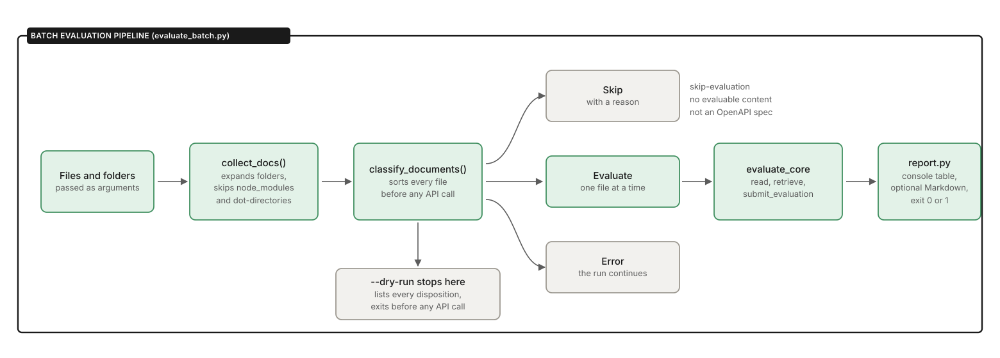
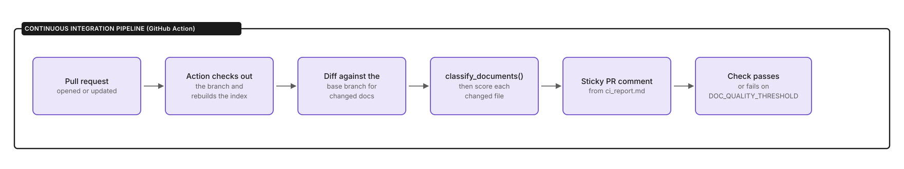

# How it works

The `doc-quality-evaluator` automates doc workflows with AI as a force multiplier, letting you keep editorial control.

## How `baseline` evaluation works

The following image shows the `baseline` evaluation flow for Markdown and MDX.


## How `RAG-enhanced` evaluation works

The following image shows the `RAG-enhanced` evaluation flow for Markdown and MDX. The document is read first because the retrieval query is built from its opening content; the declared `docType`'s own guideline chunk is then added regardless of similarity ranking.


## How batch evaluation works

The following image shows the batch flow. Unlike the single-file pipelines, every file is classified before any API call, so skipped and errored files never reach the model.



## How continuous integration works

The following image shows the pull request flow. It reuses the same classification and scoring core as the batch runner.



## Status messages

The `doc-quality-evaluator` prints status messages before the JSON results. If you pipe the output to a file (`python3 evaluate.py samples/doc.mdx > report.json`), the status messages will be mixed in with the JSON. You have two choices:

* If clean piped output matters for your workflow, the conventional fix is to send status messages to `stderr` and reserve `stdout` for the JSON &mdash; a one-line change (`print(..., file=sys.stderr)`) that keeps piped output clean.
* Copy the JSON from below the divider line to a report file.

A `baseline` evaluation for a Markdown file (for example, `webhooks-Admin-UI.md`) begins with the following status messages:

```text
Evaluating: samples/webhooks-Admin-UI.md
Calling Anthropic API...

── Evaluation Results ──────────────────────────────────────────────────
```

A `RAG-enhanced` evaluation for a Markdown file (for example, `webhooks-Admin-UI.md`) begins with:

```text
Evaluating: samples/webhooks-Admin-UI.md

Retrieved 5 guideline chunk(s) from the knowledge base:
  - diataxis_types.md chunk 2  (similarity distance: 1.3136)
  - diataxis_types.md chunk 3  (similarity distance: 1.5654)
  - api_doc_standards.md chunk 5  (similarity distance: 1.5762)
  - api_doc_standards.md chunk 3  (similarity distance: 1.6455)
  - api_doc_standards.md chunk 1  (similarity distance: 1.6975)

Calling Anthropic API...

── Evaluation Results ──────────────────────────────────────────────────
```

A `baseline` evaluation for an MDX file (for example, `quickstart.mdx`) begins with:

> **Note**: The `doc-quality-evaluator` strips JSX tags from MDX files, while preserving the content.

```text
Evaluating: samples/quickstart.mdx
MDX syntax stripped — JSX tags removed, content preserved.
Calling Anthropic API...

── Evaluation Results ──────────────────────────────────────────────────
```

A `RAG-enhanced` evaluation for an MDX file (for example, `quickstart.mdx`) begins with:

```text
Evaluating: samples/quickstart.mdx
MDX syntax stripped — JSX tags removed, content preserved.

Retrieved 5 guideline chunk(s) from the knowledge base:
  - api_doc_standards.md chunk 2  (similarity distance: 1.1515)
  - api_doc_standards.md chunk 1  (similarity distance: 1.1603)
  - api_doc_standards.md chunk 3  (similarity distance: 1.2346)
  - diataxis_types.md chunk 2  (similarity distance: 1.2949)
  - diataxis_types.md chunk 3  (similarity distance: 1.3859)

Calling Anthropic API...

── Evaluation Results ──────────────────────────────────────────────────
```

## Retrieval diagnostics

A `RAG-enhanced` evaluation includes retrieval diagnostics (also called a retrieval trace). It shows which knowledge-base chunks the document matched and their similarity distances so you can verify the retrieval step is pulling the relevant guidelines.

```text
Retrieved 5 guideline chunk(s) from the knowledge base:
  - api_doc_standards.md chunk 2  (similarity distance: 1.1515)
  - api_doc_standards.md chunk 1  (similarity distance: 1.1603)
  - api_doc_standards.md chunk 3  (similarity distance: 1.2346)
  - diataxis_types.md chunk 2  (similarity distance: 1.2949)
  - diataxis_types.md chunk 3  (similarity distance: 1.3859)
```

When a document declares `docType` (see [Classifying documents with `docType`](supported-formats.md#classifying-documents-with-doctype)), the evaluator guarantees that type's own guideline chunk is included, regardless of similarity ranking. It appears in the trace with a `guaranteed match` in place of a numeric distance:

```text
Retrieved 6 guideline chunk(s) from the knowledge base:
  - api_doc_standards.md chunk 3  (similarity distance: 1.1213)
  - api_doc_standards.md chunk 4  (similarity distance: 1.1216)
  - api_doc_standards.md chunk 1  (similarity distance: 1.1740)
  - diataxis_types.md chunk 3  (similarity distance: 1.2341)
  - api_doc_standards.md chunk 0  (similarity distance: 1.2515)
  - diataxis_types.md chunk 6  (similarity distance: guaranteed match)
```

## Scoring

The `doc-quality-evaluator` scores a Markdown or MDX doc on five criteria and returns structured JSON feedback.

* **Clarity**: Is the writing clear and free of ambiguity?
* **Completeness**: Are all parameters, responses, and error codes documented?
* **Accuracy**: Are code examples syntactically correct and realistic?
* **Consistency**: Are the terminology, tone, and formatting consistent throughout?
* **Structure**: Does the content follow the appropriate Diátaxis type (tutorial / how-to / reference / explanation / overview)?

Scores range from 1 (lowest) to 5 (highest). The evaluator provides clear feedback to improve your doc. If you see a 0, check your input file.

---

[Back to the doc-quality-evaluator README](../README.md)
